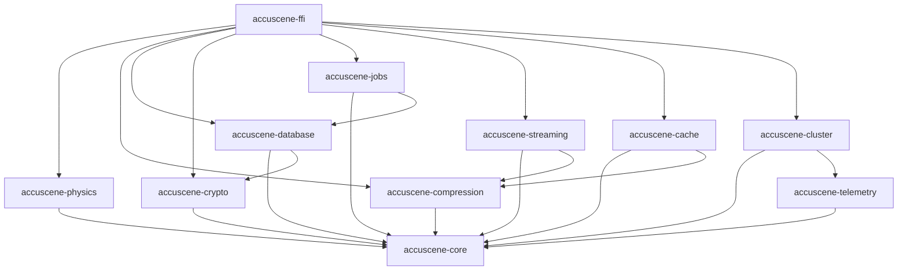

# AccuScene Enterprise Rust System - Architecture Documentation

**Version:** 0.1.5
**Last Updated:** 2025-12-28
**Status:** Initial Design

---

## Table of Contents

1. [Overview](#overview)
2. [Design Principles](#design-principles)
3. [System Architecture](#system-architecture)
4. [Module Descriptions](#module-descriptions)
5. [Data Flow](#data-flow)
6. [FFI Integration](#ffi-integration)
7. [Concurrency Model](#concurrency-model)
8. [Error Handling Strategy](#error-handling-strategy)
9. [Security Architecture](#security-architecture)
10. [Performance Considerations](#performance-considerations)
11. [Deployment Architecture](#deployment-architecture)
12. [Decision Log](#decision-log)

---

## Overview

The AccuScene Enterprise Rust system is designed as a high-performance computational backend for accident reconstruction and forensic analysis. It provides:

- **Physics Simulation:** Real-time vehicle dynamics and collision modeling
- **Data Processing:** Efficient compression, encryption, and storage
- **Distributed Computing:** Clustering and job distribution
- **Node.js Integration:** Seamless FFI bridge for Electron application

### Key Goals

1. **Performance:** Sub-millisecond FFI overhead, 60 FPS physics simulation
2. **Reliability:** Zero-downtime operation, fault tolerance
3. **Security:** Defense-in-depth encryption and authentication
4. **Scalability:** Horizontal scaling via clustering
5. **Maintainability:** Clear module boundaries, comprehensive documentation

---

## Design Principles

### 1. Separation of Concerns
Each crate has a single, well-defined responsibility:
- `accuscene-core`: Common types and utilities
- `accuscene-physics`: Physics calculations only
- `accuscene-database`: Data persistence only
- etc.

### 2. Dependency Inversion
Higher-level modules depend on abstractions (traits), not concrete implementations:
```rust
// Good: Depends on trait
pub async fn process_scene<R: SceneRepository>(repo: &R, id: Uuid) -> Result<()>

// Avoid: Depends on concrete type
pub async fn process_scene(repo: &PostgresRepository, id: Uuid) -> Result<()>
```

### 3. Error Transparency
Errors are typed, structured, and always contain context:
```rust
#[derive(Error, Debug)]
pub enum PhysicsError {
    #[error("Invalid vehicle mass: {mass} kg (must be > 0)")]
    InvalidMass { mass: f64 },
}
```

### 4. Zero-Cost Abstractions
Use Rust's type system for compile-time guarantees without runtime overhead:
- Generics over dynamic dispatch where possible
- `const fn` for compile-time computation
- Inline hints for hot paths

### 5. Safe by Default
Minimize `unsafe` code, document all invariants:
```rust
/// # Safety
/// Caller must ensure `ptr` is valid and not aliased.
pub unsafe fn get_unchecked(&self, ptr: *const T) -> &T
```

---

## System Architecture

### Layered Architecture

```
┌─────────────────────────────────────────────────────────────┐
│                     Integration Layer                        │
│                     (accuscene-ffi)                          │
│  - N-API bindings                                            │
│  - TypeScript definitions                                    │
│  - Promise-based async APIs                                  │
└─────────────────────────────────────────────────────────────┘
                            ↑
┌─────────────────────────────────────────────────────────────┐
│                   Application Layer                          │
│  ┌──────────┬──────────┬───────────┬───────────┐            │
│  │ Physics  │   Jobs   │ Streaming │  Cluster  │            │
│  └──────────┴──────────┴───────────┴───────────┘            │
│  - Business logic                                            │
│  - Orchestration                                             │
│  - Domain models                                             │
└─────────────────────────────────────────────────────────────┘
                            ↑
┌─────────────────────────────────────────────────────────────┐
│                    Infrastructure Layer                      │
│  ┌──────────┬──────────────┬──────────┬────────────┐        │
│  │ Database │ Compression  │  Crypto  │ Telemetry  │        │
│  └──────────┴──────────────┴──────────┴────────────┘        │
│  - Storage                                                   │
│  - Security                                                  │
│  - Observability                                             │
└─────────────────────────────────────────────────────────────┘
                            ↑
┌─────────────────────────────────────────────────────────────┐
│                      Foundation Layer                        │
│                     (accuscene-core)                         │
│  - Common types (EntityId, Vector3, etc.)                    │
│  - Error types                                               │
│  - Utilities                                                 │
│  - Configuration                                             │
└─────────────────────────────────────────────────────────────┘
```

### Module Dependencies



---

## Module Descriptions

### accuscene-core

**Purpose:** Foundation for all other crates

**Key Components:**
- `types.rs`: Common type aliases (EntityId, Timestamp, Vector3)
- `error.rs`: Base error types and Result aliases
- `config.rs`: Configuration management
- `utils.rs`: Shared utilities

**Public API:**
```rust
pub type EntityId = Uuid;
pub type Timestamp = DateTime<Utc>;
pub type Result<T> = std::result::Result<T, Error>;

#[derive(Error, Debug)]
pub enum Error {
    #[error("Configuration error: {0}")]
    Config(String),
    // ...
}
```

### accuscene-physics

**Purpose:** High-performance physics simulation

**Key Components:**
- `simulator.rs`: Main simulation engine
- `vehicle.rs`: Vehicle dynamics
- `collision.rs`: Collision detection and response
- `trajectory.rs`: Trajectory calculations

**Public API:**
```rust
pub struct Simulator {
    config: PhysicsConfig,
}

impl Simulator {
    pub async fn simulate(&self, scene: &Scene) -> Result<SimulationResult>;
    pub async fn step(&mut self, dt: f64) -> Result<()>;
}
```

**Performance Targets:**
- 60 FPS (16ms per frame)
- Support for 100+ vehicles simultaneously
- Deterministic results (same inputs → same outputs)

### accuscene-database

**Purpose:** Persistent storage abstraction

**Key Components:**
- `repository.rs`: Repository pattern traits
- `postgres.rs`: PostgreSQL implementation
- `sqlite.rs`: SQLite implementation
- `migrations.rs`: Schema migrations

**Public API:**
```rust
#[async_trait]
pub trait SceneRepository: Send + Sync {
    async fn find_by_id(&self, id: EntityId) -> Result<Option<Scene>>;
    async fn save(&self, scene: &Scene) -> Result<()>;
    async fn delete(&self, id: EntityId) -> Result<()>;
}
```

### accuscene-ffi

**Purpose:** Node.js integration via N-API

**Key Components:**
- `lib.rs`: Main N-API exports
- `physics.rs`: Physics API bindings
- `database.rs`: Database API bindings
- `types.rs`: Type conversions

**Public API (JavaScript):**
```typescript
export class PhysicsSimulator {
  constructor(config: PhysicsConfig);
  simulate(scene: Scene): Promise<SimulationResult>;
  step(dt: number): Promise<void>;
}
```

---

## Data Flow

### Scene Simulation Flow

```
User (TypeScript)
    ↓ (calls simulate())
FFI Layer (accuscene-ffi)
    ↓ (converts types)
Physics Engine (accuscene-physics)
    ↓ (reads scene data)
Database Layer (accuscene-database)
    ↓ (queries PostgreSQL)
PostgreSQL
    ↓ (returns encrypted data)
Crypto Layer (accuscene-crypto)
    ↓ (decrypts data)
Physics Engine
    ↓ (runs simulation)
Cache Layer (accuscene-cache)
    ↓ (stores result)
FFI Layer
    ↓ (converts result)
User (TypeScript)
```

### Event Streaming Flow

```
Application Event
    ↓
Streaming Layer (accuscene-streaming)
    ↓ (compresses event)
Compression Layer
    ↓ (publishes to stream)
Event Store
    ↓ (broadcasts to subscribers)
Multiple Consumers
    ├→ Telemetry (metrics)
    ├→ Database (persistence)
    └→ FFI (real-time updates)
```

---

## FFI Integration

### N-API Bridge Architecture

```
┌─────────────────────────────────────────┐
│         Node.js / Electron               │
│                                          │
│  ┌────────────────────────────────────┐ │
│  │  TypeScript Application Code       │ │
│  └────────────────────────────────────┘ │
│                  ↓                       │
│  ┌────────────────────────────────────┐ │
│  │  Generated .d.ts Definitions       │ │
│  └────────────────────────────────────┘ │
└─────────────────────────────────────────┘
                  ↓ (FFI)
┌─────────────────────────────────────────┐
│         accuscene-ffi.node               │
│  (Native Addon - compiled Rust)          │
│                                          │
│  ┌────────────────────────────────────┐ │
│  │  N-API Bindings (napi-rs)          │ │
│  └────────────────────────────────────┘ │
│                  ↓                       │
│  ┌────────────────────────────────────┐ │
│  │  Type Conversions                  │ │
│  │  - JS Object ↔ Rust Struct         │ │
│  │  - Promise ↔ Future                │ │
│  │  - Buffer ↔ Vec<u8>                │ │
│  └────────────────────────────────────┘ │
│                  ↓                       │
│  ┌────────────────────────────────────┐ │
│  │  Rust Core Modules                 │ │
│  │  - Physics, Database, etc.         │ │
│  └────────────────────────────────────┘ │
└─────────────────────────────────────────┘
```

### Type Mapping

| JavaScript | Rust | Notes |
|------------|------|-------|
| `number` | `f64` | IEEE 754 double |
| `bigint` | `i64` | 64-bit integer |
| `string` | `String` | UTF-8 encoded |
| `boolean` | `bool` | Single byte |
| `Buffer` | `Vec<u8>` | Zero-copy when possible |
| `Promise` | `Future` | Async task |
| `Object` | `JsObject` | Custom conversion |
| `Array` | `Vec<T>` | Homogeneous collections |

### Async Handling

All long-running operations return Promises:

```rust
#[napi]
pub async fn simulate_scene(scene: Scene) -> Result<SimulationResult> {
    // Runs on Tokio thread pool
    let result = physics::simulate(scene).await?;
    Ok(result)
}
```

---

## Concurrency Model

### Tokio Async Runtime

All I/O operations use Tokio's multi-threaded runtime:

```rust
#[tokio::main]
async fn main() -> Result<()> {
    // Tokio manages thread pool
    let server = create_server().await?;
    server.run().await
}
```

### Thread Safety

- **Immutable by Default:** Most data structures are immutable
- **Interior Mutability:** Use `Arc<Mutex<T>>` or `Arc<RwLock<T>>` sparingly
- **Lock-Free Structures:** Prefer `DashMap`, `crossbeam` channels
- **Send + Sync Bounds:** Enforced at compile time

### Parallelism

- **CPU-Bound:** Use `rayon` for data parallelism
- **I/O-Bound:** Use `tokio` for async concurrency
- **Mixed:** Combine both as needed

```rust
// CPU-bound: parallel iteration
use rayon::prelude::*;
let results: Vec<_> = vehicles
    .par_iter()
    .map(|v| simulate_vehicle(v))
    .collect();

// I/O-bound: concurrent futures
use futures::future::join_all;
let results = join_all(
    vehicles.iter().map(|v| save_to_db(v))
).await;
```

---

## Error Handling Strategy

### Error Types Hierarchy

```rust
// Base error in accuscene-core
#[derive(Error, Debug)]
pub enum Error {
    #[error("Internal error: {0}")]
    Internal(String),

    #[error(transparent)]
    Io(#[from] std::io::Error),
}

// Domain-specific errors
#[derive(Error, Debug)]
pub enum PhysicsError {
    #[error("Invalid vehicle mass: {0}")]
    InvalidMass(f64),

    #[error("Simulation diverged")]
    Divergence,

    #[error(transparent)]
    Core(#[from] accuscene_core::Error),
}
```

### Error Context

Always add context with `anyhow`:

```rust
use anyhow::Context;

let scene = load_scene(id)
    .await
    .context(format!("Failed to load scene {}", id))?;
```

### Error Propagation

- **Libraries:** Return `Result<T, SpecificError>`
- **Applications:** Use `anyhow::Result<T>`
- **FFI Boundary:** Convert to string for JavaScript

---

## Security Architecture

### Defense in Depth

1. **Input Validation:** All external inputs validated at FFI boundary
2. **Encryption at Rest:** AES-256-GCM for sensitive data
3. **Encryption in Transit:** TLS 1.3 for network communication
4. **Authentication:** API keys hashed with Argon2id
5. **Authorization:** Role-based access control (RBAC)
6. **Audit Logging:** All security events logged

### Cryptographic Standards

- **Symmetric Encryption:** AES-256-GCM
- **Password Hashing:** Argon2id (19 MiB memory, 2 iterations, 1 thread)
- **Key Derivation:** PBKDF2-SHA256 (100,000 iterations)
- **HMAC:** HMAC-SHA256
- **Random Generation:** OS-provided CSPRNG via `getrandom`

### Secure Coding Practices

```rust
// ❌ Avoid: Timing attack vulnerable
pub fn verify_password(hash: &str, password: &str) -> bool {
    hash == password  // String comparison is not constant-time
}

// ✅ Correct: Constant-time comparison
use subtle::ConstantTimeEq;
pub fn verify_password(hash: &[u8], password: &[u8]) -> bool {
    hash.ct_eq(password).into()
}
```

---

## Performance Considerations

### Hot Paths

Identified performance-critical code:

1. **Physics Simulation Loop:** 60 FPS requirement
2. **FFI Calls:** Minimize overhead (<1ms)
3. **Database Queries:** Connection pooling, prepared statements
4. **Compression/Decompression:** Streaming APIs
5. **Crypto Operations:** Hardware acceleration when available

### Optimization Techniques

- **Inlining:** `#[inline]` for small hot functions
- **SIMD:** Use `nalgebra` with SIMD features enabled
- **Memory Layout:** `#[repr(C)]` for FFI, cache-friendly structures
- **Allocations:** Preallocate buffers, use object pools
- **Benchmarking:** `criterion` for micro-benchmarks

### Profiling

```bash
# CPU profiling
cargo flamegraph --bench physics_bench

# Memory profiling
RUSTFLAGS="-Z instrument-mcount" cargo build
valgrind --tool=massif ./target/debug/accuscene

# Async profiling
tokio-console
```

---

## Deployment Architecture

### Single-Node Deployment

```
┌─────────────────────────────────────┐
│         Electron Application         │
│  ┌───────────────────────────────┐  │
│  │  Renderer Process             │  │
│  │  (React UI)                   │  │
│  └───────────────────────────────┘  │
│              ↓ IPC                  │
│  ┌───────────────────────────────┐  │
│  │  Main Process                 │  │
│  │  ├─ accuscene-ffi.node        │  │
│  │  └─ Rust Runtime              │  │
│  └───────────────────────────────┘  │
└─────────────────────────────────────┘
              ↓
┌─────────────────────────────────────┐
│      Local Database (SQLite)         │
└─────────────────────────────────────┘
```

### Distributed Deployment

```
┌───────────────┐  ┌───────────────┐  ┌───────────────┐
│  Electron 1   │  │  Electron 2   │  │  Electron 3   │
│  (Client)     │  │  (Client)     │  │  (Client)     │
└───────────────┘  └───────────────┘  └───────────────┘
        ↓                  ↓                  ↓
┌──────────────────────────────────────────────────────┐
│              Load Balancer (Nginx)                    │
└──────────────────────────────────────────────────────┘
        ↓                  ↓                  ↓
┌───────────────┐  ┌───────────────┐  ┌───────────────┐
│  Rust Node 1  │  │  Rust Node 2  │  │  Rust Node 3  │
│  (Leader)     │←→│  (Follower)   │←→│  (Follower)   │
└───────────────┘  └───────────────┘  └───────────────┘
        ↓                  ↓                  ↓
┌──────────────────────────────────────────────────────┐
│            Shared Database (PostgreSQL)               │
└──────────────────────────────────────────────────────┘
        ↓                  ↓                  ↓
┌──────────────────────────────────────────────────────┐
│              Shared Cache (Redis)                     │
└──────────────────────────────────────────────────────┘
```

---

## Decision Log

### ADR-001: Use Rust for Backend
**Date:** 2025-12-28
**Status:** Accepted

**Context:** Need high-performance backend for physics simulation.

**Decision:** Use Rust for all backend code.

**Rationale:**
- Memory safety without garbage collection
- Zero-cost abstractions
- Excellent FFI support via napi-rs
- Strong ecosystem for async, networking, databases

**Consequences:**
- Learning curve for Rust
- Compilation times longer than interpreted languages
- Excellent performance and safety guarantees

---

### ADR-002: Use napi-rs for FFI
**Date:** 2025-12-28
**Status:** Accepted

**Context:** Need to integrate Rust with Node.js/Electron.

**Decision:** Use napi-rs for N-API bindings.

**Rationale:**
- Type-safe bindings with derive macros
- Automatic TypeScript definition generation
- Active development and maintenance
- Better performance than node-ffi

**Consequences:**
- Requires compilation step
- Platform-specific binaries
- Excellent type safety and performance

---

### ADR-003: Workspace Structure
**Date:** 2025-12-28
**Status:** Accepted

**Context:** Organize multiple related crates.

**Decision:** Use Cargo workspace with separate crates per domain.

**Rationale:**
- Clear module boundaries
- Independent versioning possible
- Parallel compilation
- Easier testing

**Consequences:**
- More Cargo.toml files to maintain
- Better organization and build times

---

### ADR-004: Tokio for Async Runtime
**Date:** 2025-12-28
**Status:** Accepted

**Context:** Need async runtime for I/O operations.

**Decision:** Use Tokio as the async runtime.

**Rationale:**
- Most popular async runtime
- Excellent ecosystem integration
- Good documentation
- Multi-threaded by default

**Consequences:**
- Binary size increase
- Single runtime choice (no async-std mix)
- Industry-standard performance

---

## Future Considerations

### Potential Enhancements

1. **WebAssembly Target:** Compile physics engine to WASM for browser use
2. **GPU Acceleration:** Use compute shaders for parallel physics
3. **Machine Learning:** Integrate ML models for accident prediction
4. **Cloud Deployment:** Kubernetes-based distributed deployment
5. **Real-time Collaboration:** Operational transformation for multi-user editing

### Technical Debt

- [ ] Comprehensive error recovery strategies
- [ ] Circuit breaker pattern for external services
- [ ] Distributed tracing correlation IDs
- [ ] Chaos engineering tests
- [ ] Formal verification of critical algorithms

---

**Document Maintenance:**
This document should be updated whenever architectural decisions are made. All agents should review this before implementing features.
